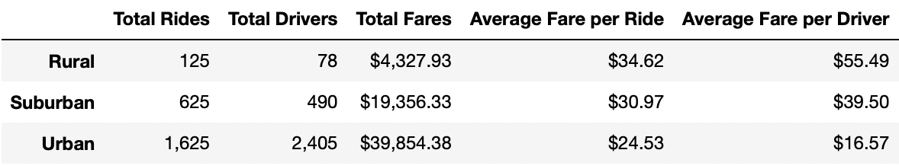

# **RIDE SHARING DATA DIFFERENCES BY CITY TYPE**

## ***OVERVIEW***

### The purpose of this analysis is to provide the PyBer CEO with information regarding the total weekly fares by city type in order to help in the decision making process which could lead to a better customer service.

## ***RESULTS***

### **Differences in the Ride Sharing Data**

#### From the image above we can see the following differences:
#### 1. The number of rides in the Urban type is significantly higher that in the Suburban and Rural tpes, with a 2.6 and 13 times lower rides, respectively.
#### 2. There is also a big difference in the number of drivers per city type, Suburban has 4.9 times less drivers than the Urban type and thr rural type has even less with a significant 30.8 times less drivers.
#### 3. Regarding the revenue by city type, we can see that the Suburban type is only 2 times less than in the Urban type and the Rural type 9.2 times lower than the Urban type, potentially due to the much lower driver quantity.
#### 4. Now, on the other hand, revenue wise the situation is a little different if we look at the average fare per ride. We can appreciate that the Suburban type has a 26% higher amount than the Urban type and the Rural type has a 41% higher amount than in the Urban type. This might be explained due to the offer and demand effect where the lesser drivers available makes the rides more expensive.
#### 5. Similarly, if we look at the average fare per driver, we can see that the Suburban and Rural types are 2.4 and 3.3 times higher than in the Urban type, respectively, possibly explained by the same reason than in the average fare per ride.

#### 6. Finally, observe the following image which shows the total fare by city type:

#### By looking at the image, we can see that from January through April 2019, the Urban city type increases fares by almost 50%, the Suburban type almost doubles the fares from January to February and in the Rural type case the difference from January through April is several times higher.

## ***SUMMARY***

### Based on the presented information, we suggest the following actions to balance the difference among the city types:
### 1. Increase the number of drivers in both the Suburban and Rural types, which will allow to better serve the customers. This can be done by moving some of the Urban drivers to the other locations or hiring new drivers.
### 2. Decrease the fare amount in both the Suburban and Rural types, this will make the service more accesible for more people and so the ride count will increase.
### 3. Balance the fare increase during the period of March and April in order to avoid having the huge increases seen in the date so that customers are more satisfied with the service.
